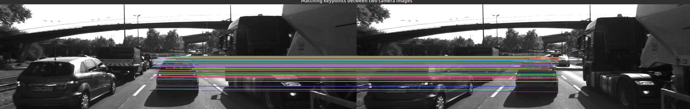
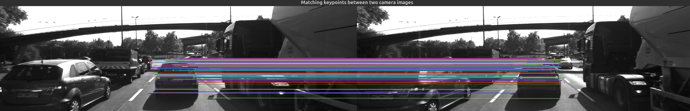
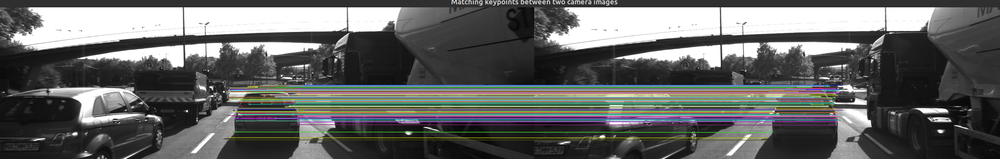
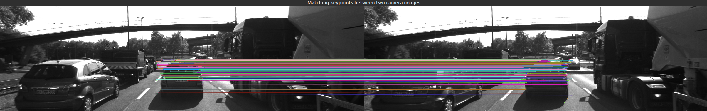
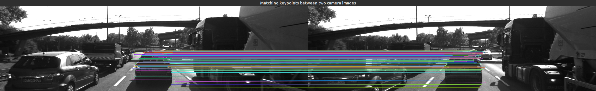
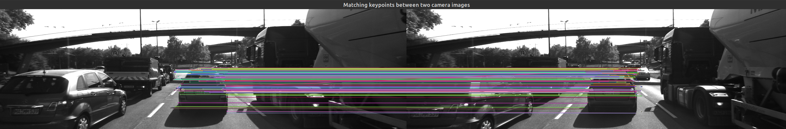
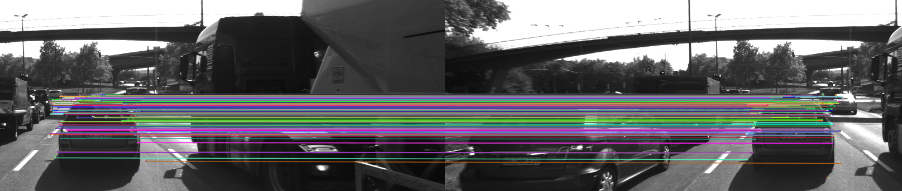
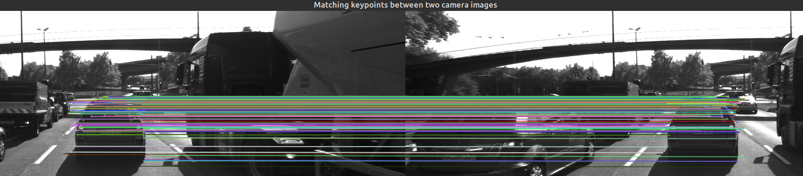
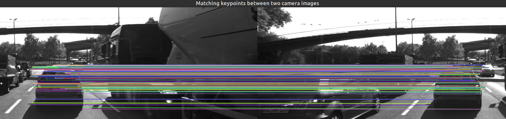

# SFND 2D Feature Tracking Report

![Sensor-Fusion][1]
![Udacity][2]
![Computer-Vision][3]
![Open-CV][4]
![Covid-19][5]

[1]: https://img.shields.io/:Sensor-Fusion-whiteGreen.svg?style=round-square
[2]: https://img.shields.io/:Udacity-blue.svg?style=round-square
[3]: https://img.shields.io/:Computer-Vision-yellow.svg?style=round-square
[4]: https://img.shields.io/:Open-CV-purple.svg?style=round-square
[5]: https://img.shields.io/:Covid-19-red.svg?style=round-square

---

## MP.1 Data Buffer Optimization
* I set `dataBuffer` size to 2. It is as if I am using a ring queue. If size exceeded, I remove the first one and add new image at the end.
---

## MP.2 Keypoint Detection

* I implemented all the detectors, not from scratch but using openCV built-in functions
* I used select case instead of for loop to select descriptors. To avoid using compare, I first tried to get the hash of the string (but failed). So, I built an Enum and implemented a function to map each string to its corresponding index. (this is applied for descriptors as well)

---

## MP.3 Keypoint Removal
* I checked whether each point is in the rectangle. If it is, I include it to a temporary vector. Then, re-assign `keypoints` with the temporary one.

---

## MP.4 Keypoint Descriptors
* I implemented all the descriptors using openCV built-in functions
---

## MP.5 Descriptor Matching
* I used the open-cv built-in functions to implement both FLANN and KNN.
---

## MP.6 Descriptor Distance Ratio

I applied the knn using the built-in function `knnMatch` with distance ratio 0.8. Based on this ratio I decide to choose whether the best match or second-best match

---

## MP.7 Performance Evaluation 1

* I built a function write_a to write data inside a CSV file
* I counted the number of keypoints on the preceding vehicle and wrote it inside a CSV file

---

## MP.8 Performance Evaluation 2
Count the number of matched keypoints for all 10 images using all possible combinations of detectors and descriptors. In the matching step, the BF approach is used with the descriptor distance ratio set to 0.8.

* I implmented a loop to loop over the detectors and desriptors to get all possible combinations. I used KNN clustering and set ratio to 0.8 as required

* All data are stored in a CSV file attached to the project

---

## MP.9 Performance Evaluation 3

* As well as logging number of keypoints, I logged time for detection and descriptor extraction. I also, stored them in the same CSV for a better comparison.

the TOP3 detector / descriptor combinations: (sorted the csv)
1. BRISK + ORB
1. FAST + ORB
1. ORB + ORB

---

## Snapshots

### BRISK + ORB

### FAST + ORB

### ORB + ORB

